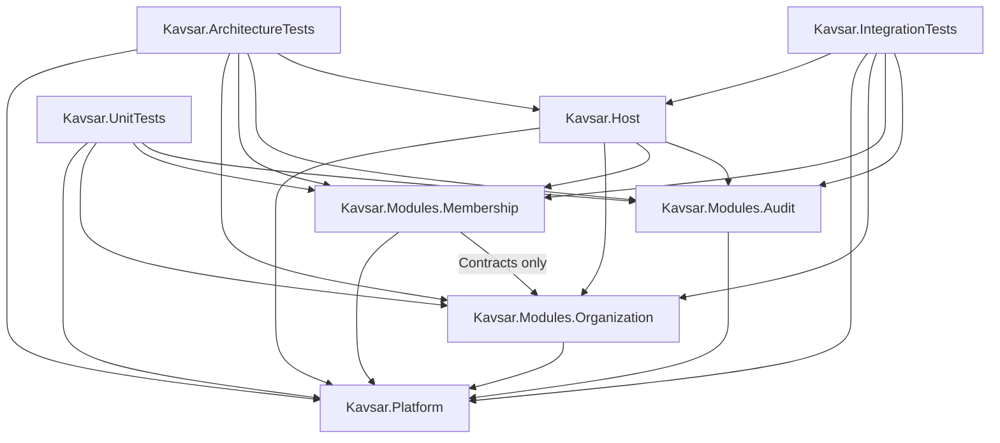

No files were modified.

The smallest production-grade structure I recommend contains five production projects and three test projects. Each business capability remains a single assembly for M1; shared architectural mechanisms are centralized without owning domain data.

## A. Proposed directory tree

```text
Kavsar.slnx

src/
├── Kavsar.Platform/
│   ├── Kavsar.Platform.csproj
│   ├── Execution/
│   ├── Identity/
│   ├── Lifecycle/
│   ├── Events/
│   ├── Outbox/
│   ├── Persistence/
│   └── DependencyInjection/
│
├── Kavsar.Modules.Organization/
│   ├── Kavsar.Modules.Organization.csproj
│   ├── Contracts/
│   ├── Domain/
│   │   ├── Tenants/
│   │   └── Companies/
│   ├── Services/
│   ├── Lifecycle/
│   ├── Events/
│   ├── Persistence/
│   │   ├── OrganizationDbContext.cs
│   │   ├── Configurations/
│   │   └── Migrations/
│   └── DependencyInjection/
│
├── Kavsar.Modules.Membership/
│   ├── Kavsar.Modules.Membership.csproj
│   ├── Contracts/
│   ├── Domain/
│   │   └── OrganizationalMemberships/
│   ├── Services/
│   ├── Lifecycle/
│   ├── Events/
│   ├── Persistence/
│   │   ├── MembershipDbContext.cs
│   │   ├── Configurations/
│   │   └── Migrations/
│   └── DependencyInjection/
│
├── Kavsar.Modules.Audit/
│   ├── Kavsar.Modules.Audit.csproj
│   ├── Contracts/
│   ├── Domain/
│   ├── Services/
│   ├── Persistence/
│   │   ├── AuditDbContext.cs
│   │   ├── Configurations/
│   │   └── Migrations/
│   └── DependencyInjection/
│
└── Kavsar.Host/
    ├── Kavsar.Host.csproj
    ├── Program.cs
    ├── Configuration/
    ├── Composition/
    └── Persistence/

tests/
├── Kavsar.ArchitectureTests/
│   ├── Kavsar.ArchitectureTests.csproj
│   ├── ModuleBoundaryTests.cs
│   ├── CapabilityOwnershipTests.cs
│   └── DependencyRuleTests.cs
│
├── Kavsar.UnitTests/
│   ├── Kavsar.UnitTests.csproj
│   ├── Platform/
│   ├── Organization/
│   ├── Membership/
│   └── Audit/
│
└── Kavsar.IntegrationTests/
    ├── Kavsar.IntegrationTests.csproj
    ├── Infrastructure/
    ├── PlatformServices/
    ├── TenantIsolation/
    ├── Persistence/
    ├── Audit/
    └── Events/
```

Folders within projects should be introduced as their contents are implemented. Empty folder scaffolding is unnecessary.

## Proposed production projects

### `src/Kavsar.Platform/Kavsar.Platform.csproj`

Project name: `Kavsar.Platform`

Responsibility:

- Platform Service abstractions and execution pipeline.
- `ExecutionContext`.
- Tenant-context abstractions.
- Identity references required by M1, such as `UserId`.
- Common lifecycle execution infrastructure.
- Platform Event envelope and common event contracts.
- Transactional Outbox infrastructure and contracts.
- Shared transaction coordination.
- Institutional identifier primitives.
- Common service outcomes and concurrency contracts.
- Interfaces used by centralized Audit.

This project owns infrastructure conventions, not Tenant, Company, Membership, or Audit business data.

May reference:

- .NET framework assemblies.
- Approved EF Core and Npgsql packages where required for transaction and Outbox infrastructure.

Must not reference:

- `Kavsar.Modules.Organization`
- `Kavsar.Modules.Membership`
- `Kavsar.Modules.Audit`
- `Kavsar.Host`

It must remain dependency-inward and domain-neutral.

### `src/Kavsar.Modules.Organization/Kavsar.Modules.Organization.csproj`

Project name: `Kavsar.Modules.Organization`

Responsibility:

- Tenant and Company domain models.
- Organization invariants.
- M1 Tenant and Company lifecycle semantics.
- Tenant and Company Platform Services.
- Organization-owned Institutional and Business Event definitions.
- Organization persistence, EF mappings, and migrations.
- Public contracts required by Membership, such as organizational-entity reference validation.
- Organization module registration.

May reference:

- `Kavsar.Platform`

Must not reference:

- `Kavsar.Modules.Membership`
- `Kavsar.Modules.Audit`
- `Kavsar.Host`

It should use Platform-owned audit and event contracts instead of calling Audit implementation details.

### `src/Kavsar.Modules.Membership/Kavsar.Modules.Membership.csproj`

Project name: `Kavsar.Modules.Membership`

Responsibility:

- Organizational Membership domain model.
- Multiple-membership and effective-period invariants.
- M1 Membership lifecycle semantics.
- Membership Platform Services.
- Membership-owned Institutional and Business Events.
- Membership persistence, EF mappings, and migrations.
- Membership module registration.

May reference:

- `Kavsar.Platform`
- `Kavsar.Modules.Organization`, but only its explicitly public `Contracts` namespace.

The Organization reference is justified because Membership must validate that its organizational-entity reference exists and belongs to the same Tenant. This is an explicit capability contract, not ownership transfer.

Must not reference:

- Organization’s `Domain`, `Services`, `Persistence`, or lifecycle implementation.
- `Kavsar.Modules.Audit`
- `Kavsar.Host`

### `src/Kavsar.Modules.Audit/Kavsar.Modules.Audit.csproj`

Project name: `Kavsar.Modules.Audit`

Responsibility:

- Centralized append-only Audit records.
- Audit persistence and EF mappings.
- Implementation of Platform-owned audit-writing contracts.
- Audit querying contracts required by authorized consumers.
- Audit module registration.

May reference:

- `Kavsar.Platform`

Must not reference:

- `Kavsar.Modules.Organization`
- `Kavsar.Modules.Membership`
- `Kavsar.Host`

Audit records must use institutional identifiers and descriptive object types. Audit must not need business-domain assemblies to reference audited objects.

### `src/Kavsar.Host/Kavsar.Host.csproj`

Project name: `Kavsar.Host`

Responsibility:

- ASP.NET Core executable host.
- Composition root.
- Configuration and dependency registration.
- Database connection and transaction composition.
- Authentication boundary adaptation.
- Execution Context creation at the transport boundary.
- Migration startup tooling or migration orchestration.
- Outbox background dispatch.
- Health checks and observability wiring.
- API endpoints when an API is added.

May reference:

- `Kavsar.Platform`
- `Kavsar.Modules.Organization`
- `Kavsar.Modules.Membership`
- `Kavsar.Modules.Audit`

Must not:

- Own domain models.
- Implement domain rules.
- mutate module persistence directly;
- duplicate Platform Service behavior;
- expose module persistence entities directly as API models.

The Host is the composition root, not a business capability.

## Proposed test projects

### `tests/Kavsar.ArchitectureTests/Kavsar.ArchitectureTests.csproj`

Project name: `Kavsar.ArchitectureTests`

Responsibility:

- Automated enforcement of assembly, namespace, visibility, and dependency rules.

May reference:

- All production projects.

Must not:

- Be referenced by any production project.
- Contain business behavior tests that belong in unit or integration tests.

A dedicated architecture-testing library is not required initially. Reflection and project-reference inspection are sufficient. A library may be added later only with documented justification.

### `tests/Kavsar.UnitTests/Kavsar.UnitTests.csproj`

Project name: `Kavsar.UnitTests`

Responsibility:

- Fast tests for domain invariants, lifecycle rules, service validation, event derivation, and common infrastructure.

May reference:

- `Kavsar.Platform`
- `Kavsar.Modules.Organization`
- `Kavsar.Modules.Membership`
- `Kavsar.Modules.Audit`

Must not reference:

- `Kavsar.Host`, unless a future host-specific unit test provides concrete value.
- PostgreSQL or Testcontainers.

One consolidated M1 unit-test project avoids creating a test project for every small production assembly. Test folders preserve capability ownership.

### `tests/Kavsar.IntegrationTests/Kavsar.IntegrationTests.csproj`

Project name: `Kavsar.IntegrationTests`

Responsibility:

- Tests against real PostgreSQL through Testcontainers.
- Full Platform Service execution.
- EF Core mappings and migrations.
- Database-enforced tenant isolation.
- Cross-tenant attack tests.
- Atomic business, lifecycle, audit, Institutional Event, and Outbox persistence.
- Optimistic concurrency.
- Outbox dispatch and retry behavior.
- ASP.NET Core host integration where necessary.

May reference:

- `Kavsar.Host`
- All production projects.

Must not:

- Be referenced by production projects.
- Replace domain-level unit tests.
- bypass Platform Services except in tests explicitly verifying database safeguards.

## B. Project-reference dependency graph



There must be no production dependency cycle.

The only capability-to-capability dependency is Membership → Organization, restricted to the Organization module’s public contracts. If this restriction proves difficult to enforce reliably within one assembly, an `Organization.Contracts` project would become justified. It should not be created preemptively.

## C. Placement of required components

| Component | Owning project |
|---|---|
| Tenant domain model | `Kavsar.Modules.Organization` |
| Company domain model | `Kavsar.Modules.Organization` |
| Organizational Membership | `Kavsar.Modules.Membership` |
| Platform Service abstractions | `Kavsar.Platform` |
| Organization Platform Services | `Kavsar.Modules.Organization` |
| Membership Platform Services | `Kavsar.Modules.Membership` |
| Execution Context | `Kavsar.Platform` |
| Lifecycle infrastructure | `Kavsar.Platform` |
| Tenant/Company lifecycle semantics | `Kavsar.Modules.Organization` |
| Membership lifecycle semantics | `Kavsar.Modules.Membership` |
| Audit capability and records | `Kavsar.Modules.Audit` |
| Audit-writing abstraction | `Kavsar.Platform` |
| Platform Event envelope | `Kavsar.Platform` |
| Capability-owned event definitions | Owning capability module |
| Outbox contracts and implementation | `Kavsar.Platform` |
| Organization EF Core DbContext | `Kavsar.Modules.Organization` |
| Membership EF Core DbContext | `Kavsar.Modules.Membership` |
| Audit EF Core DbContext | `Kavsar.Modules.Audit` |
| Outbox EF persistence | `Kavsar.Platform` |
| Shared transaction composition | `Kavsar.Platform`, wired by `Kavsar.Host` |
| ASP.NET Core host | `Kavsar.Host` |
| Identity & Access M1 boundary types | `Kavsar.Platform/Identity` |
| PostgreSQL integration-test fixture | `Kavsar.IntegrationTests` |

### DbContext strategy

Use one DbContext per data-owning capability:

- `OrganizationDbContext`
- `MembershipDbContext`
- `AuditDbContext`
- A narrowly scoped platform persistence context for Outbox records if needed.

This preserves schema and migration ownership. They may share one PostgreSQL database, connection, and transaction so the approved atomicity rule is satisfied.

A single monolithic DbContext would be physically simpler, but it would centralize knowledge of every module’s persistence model and weaken future separability. Separate databases or schemas are not required for M1; logical ownership and database-enforced tenant isolation are.

## D. Project granularity by capability

### Organization Management: one project

Use one project for M1.

Tenant and Company domain logic, services, lifecycle definitions, persistence, and events belong together under one capability owner. Splitting this immediately into Domain/Application/Infrastructure projects would add references and abstractions without creating a meaningful deployment or ownership boundary.

Internal namespaces and `internal` visibility should separate implementation concerns.

### Membership Management: one project

Use one project.

Membership’s domain, services, lifecycle, events, and persistence are cohesive and independently owned. It needs one narrow public Organization contract, but that alone does not justify several Membership projects.

### Audit: one project

Use one project.

Audit is a real capability boundary and deserves its own assembly. Its domain is narrow enough that internal layering projects would provide no M1 benefit.

### Shared Platform infrastructure: one project

Use one `Kavsar.Platform` project.

Execution Context, service outcomes, lifecycle execution, event envelope, transaction coordination, Outbox, tenant context, and identity references are cross-capability architectural mechanisms. Keeping them in one carefully governed assembly avoids a collection of tiny “building block” projects.

This project must not become a dumping ground. Only genuinely platform-wide mechanisms belong there.

### Host: one project

Use one executable ASP.NET Core project as the composition root and deployment unit.

### Tests: three projects by test purpose

Use Architecture, Unit, and Integration projects. Their execution environments and responsibilities differ enough to justify separate projects:

- Architecture tests enforce static boundaries.
- Unit tests remain fast and infrastructure-free.
- Integration tests require PostgreSQL and may boot the host.

## E. Architecture rules to enforce automatically

Architecture tests should verify:

1. `Kavsar.Platform` references no capability module or Host.
2. Organization does not reference Membership, Audit, or Host.
3. Audit does not reference Organization, Membership, or Host.
4. Membership references Organization only through types in the approved `Contracts` namespace.
5. No capability references another capability’s:
   - `Domain`
   - `Services`
   - `Persistence`
   - `Lifecycle`
   - internal event implementation.
6. No production project references a test project.
7. Only Host may reference every production module.
8. Host contains no domain entities or EF entity configurations for capability-owned data.
9. Domain and persistence implementation types are non-public by default.
10. Each capability’s public surface is restricted to:
    - contracts;
    - module registration;
    - approved Platform Service entry points.
11. EF Core DbContexts do not cross-own another capability’s entities.
12. Organization owns Tenant and Company types.
13. Membership owns Organizational Membership types.
14. Audit owns Audit record types.
15. Platform Event payloads are defined by the capability that owns the fact.
16. The common Platform Event envelope exists only in `Kavsar.Platform`.
17. Business modules do not own or duplicate Audit record types.
18. Business modules do not define their own Execution Context, tenant context, Outbox, or common service-outcome abstractions.
19. Identity references in M1 remain reference/value types; no full Identity & Access domain implementation appears.
20. Capability namespaces follow the approved capability-oriented structure rather than horizontal top-level layers.

Integration tests must additionally enforce behavioral architecture:

- Cross-tenant reads and writes fail at service and database boundaries.
- Tenant references are immutable.
- Business changes, lifecycle history, Audit records, Institutional Events, and Outbox entries commit atomically.
- Failed operations leave none of those records partially committed.
- Outbox dispatch occurs only after commit.
- Dispatch failure does not roll back committed business state.
- Optimistic concurrency prevents silent overwrites.
- Migrations apply successfully to an empty real PostgreSQL database.

## F. Exact project creation order

1. `src/Kavsar.Platform/Kavsar.Platform.csproj`
2. `src/Kavsar.Modules.Organization/Kavsar.Modules.Organization.csproj`
3. `src/Kavsar.Modules.Audit/Kavsar.Modules.Audit.csproj`
4. `src/Kavsar.Modules.Membership/Kavsar.Modules.Membership.csproj`
5. `src/Kavsar.Host/Kavsar.Host.csproj`
6. `tests/Kavsar.ArchitectureTests/Kavsar.ArchitectureTests.csproj`
7. `tests/Kavsar.UnitTests/Kavsar.UnitTests.csproj`
8. `tests/Kavsar.IntegrationTests/Kavsar.IntegrationTests.csproj`

Then add them to `Kavsar.slnx` and establish only the approved project references.

Organization precedes Membership because Membership requires an explicit Organization reference-validation contract. Audit precedes Host so the execution pipeline can be composed against a real centralized Audit implementation. Integration tests come last because they exercise the completed composition.

# APPROVE THIS STRUCTURE